# 🎮 Sistema de Batalha Pokémon

Um simulador de batalhas Pokémon desenvolvido em Java, implementando mecânicas clássicas do jogo com orientação a objetos e padrões de design.

## 🚀 Características

- **Sistema de Batalha Completo**: Combate por turnos com cálculo de dano, efetividade de tipos e status
- **Pokémons Clássicos**: Implementação dos starter Pokémon da primeira geração
- **Sistema de Evolução**: Mechânica de evolução baseada em nível
- **Treinadores**: Gerenciamento de equipes de até 6 Pokémon
- **Sistema de Status**: Efeitos como envenenamento, paralisia e queimadura
- **Itens de Batalha**: Poções e antídotos para suporte estratégico
- **Padrões de Design**: Factory Pattern para criação de Pokémon e exceções customizadas

## 📊 Diagrama UML

```mermaid
classDiagram

%% Enums

class TipoPokemon {
    <<enumeration>>
    FOGO
    AGUA
    PLANTA
    ELETRICO
    VOADOR
    NORMAL
}


class StatusBatalha {
    <<enumeration>>
    EM_ANDAMENTO
    PAUSADO
    FINALIZADO
}


class StatusPokemon {
    <<enumeration>>
    SAUDAVEL
    ENVENENADO
    PARALISADO
    QUEIMADO
    DESMAIADO
}

%% Clases Base

class Pokemon {
    -String nome
    -int nivel
    -double hp
    -double hpMaximo
    -double ataque
    -double defesa
    -double velocidade
    -TipoPokemon tipo
    -StatusPokemon status
    -List~Movimento~ movimentos
    +Pokemon(String nome, int nivel, TipoPokemon tipo, double hp, double ataque, double defesa, double velocidade)
    +receberDano(double dano) void
    +curar(double quantidade) void
    +estaDesmaiado() boolean
    +getMovimentos() List~Movimento~
    +aplicarStatus(StatusPokemon novoStatus) void
    +getNome() String
    +getNivel() int
    +getHp() double
    +getTipo() TipoPokemon
    +getAtaque() double
    +getDefesa() double
    +getVelocidade() double
}


class Movimento {
    -String nome
    -TipoPokemon tipo
    -double poder
    -int precisao
    -int pp
    -int ppMaximo
    -boolean isEspecial
    +Movimento(String nome, TipoPokemon tipo, double poder, int precisao, int pp)
    +podeSerUsado() boolean
    +usar() void
    +restaurarPP() void
    +getNome() String
    +getTipo() TipoPokemon
    +getPoder() double
    +getPrecisao() int
}


%% Pokémons Concretos
%% --- TIPO FOGO ---
class Charmander {
    +Charmander(int nivel)
}
class Arcanine {
    +Arcanine(int nivel)
}

%% --- TIPO AGUA ---
class Squirtle {
    +Squirtle(int nivel)
}
class Gyarados {
    +Gyarados(int nivel)
}

%% --- TIPO PLANTA ---
class Bulbasaur {
    +Bulbasaur(int nivel)
}
class Vileplume {
    +Vileplume(int nivel)
}

%% --- TIPO ELETRICO ---
class Pikachu {
    +Pikachu(int nivel)
}
class Magnezone {
    +Magnezone(int nivel)
}

%% --- TIPO VOADOR ---
class Pidgey {
    +Pidgey(int nivel)
}
class Fearow {
    +Fearow(int nivel)
}

%% --- TIPO NORMAL ---
class Rattata {
    +Rattata(int nivel)
}
class Snorlax {
    +Snorlax(int nivel)
}


%% Clases de Treinador e Batalha

class Treinador {
    -String nome
    -List~Pokemon~ equipe
    -Pokemon pokemonAtivo
    +Treinador(String nome)
    +adicionarPokemon(Pokemon pokemon) void
    +trocarPokemonAtivo(int indiceEquipe) void
    +getPokemonAtivo() Pokemon
    +temPokemonDisponivel() boolean
    +getEquipe() List~Pokemon~
}


class Batalha {
    -Treinador treinador1
    -Treinador treinador2
    -StatusBatalha status
    -int turnoAtual
    +Batalha(Treinador t1, Treinador t2)
    +iniciar() void
    +executarTurno(AcaoBatalha acao1, AcaoBatalha acao2) void
    +isTerminada() boolean
    +getVencedor() Treinador
    -determinarOrdemDeAcao(AcaoBatalha acao1, AcaoBatalha acao2) List~AcaoBatalha~
    -verificarFimDaBatalha() void
}


%% Classes para Ações de Batalha (Command Pattern)

class AcaoBatalha {
    <<abstract>>
    #Treinador autor
    +AcaoBatalha(Treinador autor)
    +executar(Batalha batalha)* void
}


class AtacarAcao {
    -Movimento movimento
    +AtacarAcao(Treinador autor, Movimento movimento)
    +executar(Batalha batalha) void
}


class TrocarPokemonAcao {
    -int indicePokemonAlvo
    +TrocarPokemonAcao(Treinador autor, int indice)
    +executar(Batalha batalha) void
}


class UsarItemAcao {
    -Item item
    -int indicePokemonAlvo
    +UsarItemAcao(Treinador autor, Item item, int indicePokemonAlvo)
    +executar(Batalha batalha) void
}

class FugirAcao {
    +FugirAcao(Treinador autor)
    +executar(Batalha batalha) void
}


%% Sistema de Itens

class Item {
    <<abstract>>
    #String nome
    #String descricao
    +usar(Pokemon alvo)* void
}


class Pocao {
    -int quantidadeCura
    +usar(Pokemon alvo) void
}


class Antidoto {
    +usar(Pokemon alvo) void
}


%% Exceções Customizadas

class JogoException {
    <<exception>>
}

class PokemonException {
    <<exception>>
}

class BatalhaException {
    <<exception>>
}


%% Factory Pattern

class PokemonFactory {
    <<utility>>
    +criarPokemon(String especie, int nivel)$ Pokemon
}


%% Utilitários

class CalculadoraDano {
    <<utility>>
    +calcularDano(Pokemon atacante, Pokemon defensor, Movimento movimento)$ double
}


%% Relacionamentos

%% --- Herencia ---
AcaoBatalha <|-- AtacarAcao
AcaoBatalha <|-- TrocarPokemonAcao
AcaoBatalha <|-- UsarItemAcao
AcaoBatalha <|-- FugirAcao
Item <|-- Pocao
Item <|-- Antidoto
JogoException <|-- PokemonException
JogoException <|-- BatalhaException

%% Herencia de Pokémons
Pokemon <|-- Charmander
Pokemon <|-- Arcanine
Pokemon <|-- Squirtle
Pokemon <|-- Gyarados
Pokemon <|-- Bulbasaur
Pokemon <|-- Vileplume
Pokemon <|-- Pikachu
Pokemon <|-- Magnezone
Pokemon <|-- Pidgey
Pokemon <|-- Fearow
Pokemon <|-- Rattata
Pokemon <|-- Snorlax


%% --- Composición y Agregación ---
Treinador "1" *-- "1..6" Pokemon : possuiEquipe
Batalha "1" o-- "2" Treinador : participantes
Pokemon "1" o-- "1..4" Movimento : conhece

%% --- Asociación ---
Treinador "1" --> "0..1" Pokemon : pokemonAtivo
Batalha "1" --> "1" StatusBatalha : temStatus
Pokemon "1" --> "1" StatusPokemon : temStatus
Pokemon "1" --> "1" TipoPokemon : éDoTipo
AtacarAcao "1" --> "1" Movimento : usa
UsarItemAcao "1" --> "1" Item : usa

%% --- Dependencia ---
Batalha ..> AcaoBatalha : processa
Batalha ..> CalculadoraDano : utiliza
AtacarAcao ..> CalculadoraDano : utiliza
PokemonFactory ..> Pokemon : cria
```


## 🏗️ Arquitetura

O projeto segue princípios de POO com uma arquitetura bem estruturada baseada no diagrama UML acima:

### **Enums**
- `TipoPokemon`: Define os tipos elementais (Fogo, Água, Planta, Elétrico, etc.)
- `StatusPokemon`: Estados do Pokémon (Saudável, Envenenado, Paralisado, etc.)
- `StatusBatalha`: Estados da batalha (Ativa, Pausada, Finalizada)
- `TipoAcao`: Tipos de ações possíveis (Atacar, Trocar, Usar Item, Fugir)

### **Modelos Principais**
- **Pokemon** (Abstrato): Classe base com atributos e métodos essenciais
- **Pokémons Específicos**: Charmander, Charmeleon, Charizard, Squirtle, Wartortle, Blastoise, Bulbasaur, Pikachu
- **Movimento**: Representa ataques com poder, precisão e PP
- **Treinador**: Gerencia equipe de Pokémon e estatísticas
- **Batalha**: Coordena o combate entre dois treinadores

### **Sistema de Ações**
- **AcaoBatalha** (Abstrato): Interface para ações de batalha
- **AtacarAcao**: Executar um ataque
- **TrocarPokemonAcao**: Trocar Pokémon ativo
- **UsarItemAcao**: Usar item da mochila

### **Sistema de Itens**
- **Item** (Abstrato): Classe base para itens
- **Pocao**: Restaura HP do Pokémon
- **Antidoto**: Remove status de envenenamento

### **Utilitários**
- **PokemonFactory**: Criação padronizada de Pokémon
- **CalculadoraDano**: Lógica de cálculo de dano e efetividade

## 🎯 Mecânicas Implementadas

### **Sistema de Tipos**
```
Efetividade de Tipos:
- Fogo > Planta (2x dano)
- Água > Fogo (2x dano)  
- Planta > Água (2x dano)
- Elétrico > Voador (2x dano)
- Voador > Planta (2x dano)
```

### **Cálculo de Dano**
- Considera ataque do atacante vs defesa do defensor
- Aplica modificador de efetividade de tipos
- Chance de acerto crítico
- Variação aleatória de 85-100% do dano base

### **Sistema de Status**
- **Envenenado**: Perde HP por turno
- **Paralisado**: Chance de não conseguir atacar
- **Queimado**: Redução de ataque e dano por turno
- **Desmaiado**: Incapaz de batalhar

## 🛠️ Como Usar

### **Criando um Pokémon**
```java
Pokemon pikachu = PokemonFactory.criarPokemon("Pikachu", 25);
```

### **Configurando uma Batalha**
```java
Treinador ash = new Treinador("Ash");
Treinador gary = new Treinador("Gary");

ash.adicionarPokemon(PokemonFactory.criarPokemon("Pikachu", 25));
gary.adicionarPokemon(PokemonFactory.criarPokemon("Squirtle", 22));

Batalha batalha = new Batalha(ash, gary);
batalha.iniciar();
```

### **Executando Ações**
```java
// Atacar
Movimento thunderbolt = pikachu.getMovimentosDisponiveis().get(0);
AcaoBatalha atacar = new AtacarAcao(thunderbolt);

// Trocar Pokémon
AcaoBatalha trocar = new TrocarPokemonAcao(1);

// Usar item
AcaoBatalha curar = new UsarItemAcao(new Pocao());

batalha.executarTurno(atacar, trocar);
```

## 🎮 Exemplos de Uso

### **Batalha Básica**
```java
public class ExemploBatalha {
    public static void main(String[] args) {
        // Criar treinadores
        Treinador jogador1 = new Treinador("Red");
        Treinador jogador2 = new Treinador("Blue");
        
        // Montar equipes
        jogador1.adicionarPokemon(PokemonFactory.criarPokemon("Charmander", 20));
        jogador2.adicionarPokemon(PokemonFactory.criarPokemon("Squirtle", 18));
        
        // Iniciar batalha
        Batalha batalha = new Batalha(jogador1, jogador2);
        batalha.iniciar();
        
        // Batalhar até o fim
        while (!batalha.isTerminada()) {
            // Lógica de IA ou input do jogador
            AcaoBatalha acao1 = determinarAcao(jogador1);
            AcaoBatalha acao2 = determinarAcao(jogador2);
            
            batalha.executarTurno(acao1, acao2);
        }
        
        System.out.println("Vencedor: " + batalha.getVencedor().getNome());
    }
}
```

## 🔧 Requisitos

- **Java 8+**
- **JDK** para compilação
- **IDE** recomendada (IntelliJ IDEA, Eclipse, VS Code)

## 📦 Compilação e Execução

```bash
# Compilar
javac -cp . src/com/pokebattle/Main.java

# Executar
java -cp src com.batalhapokemon.Main
```

## 🚀 Funcionalidades Futuras

- [ ] Interface gráfica (Swing/JavaFX)
- [ ] Mais Pokémon e gerações
- [ ] Sistema de experiência e level up
- [ ] Movimentos especiais e efeitos
- [ ] Multiplayer online
- [ ] Save/Load de partidas
- [ ] IA mais avançada
- [ ] Sistema de itens expandido
- [ ] Animações de batalha

## 🏆 Padrões Utilizados

- **Abstract Factory**: Criação de Pokémon
- **Strategy Pattern**: Sistema de ações de batalha
- **State Pattern**: Status de Pokémon e batalha
- **Template Method**: Estrutura base de Pokémon
- **Exception Handling**: Tratamento de erros específicos

## 📝 Contribuição

1. Fork o projeto
2. Crie uma branch para sua feature (`git checkout -b feature/AmazingFeature`)
3. Commit suas mudanças (`git commit -m 'Add some AmazingFeature'`)
4. Push para a branch (`git push origin feature/AmazingFeature`)
5. Abra um Pull Request

## 📄 Licença

Este projeto está sob a licença MIT. Veja o arquivo `LICENSE` para mais detalhes.

## 👥 Autor

Desenvolvido com ❤️ para aprender POO e padrões de design

---

**Gotta Code 'Em All!** ⚡🔥💧🌱