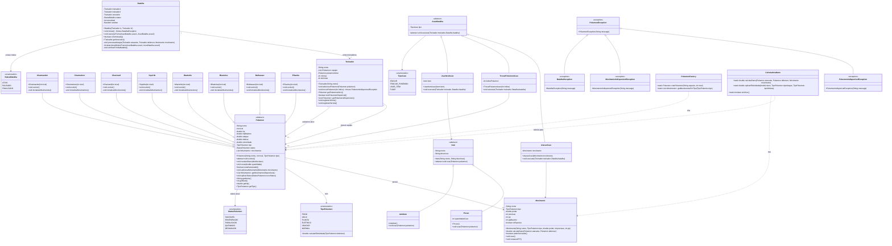

# 🎮 PokeBattle - Sistema de Batalha Pokémon

Um simulador de batalhas Pokémon desenvolvido em Java, implementando mecânicas clássicas do jogo com orientação a objetos e padrões de design.

## 🚀 Características

- **Sistema de Batalha Completo**: Combate por turnos com c√°lculo de dano, efetividade de tipos e status
- **Pokémons Clássicos**: Implementação dos starter Pokémon da primeira geração
- **Sistema de Evolução**: Mechânica de evolução baseada em nível
- **Treinadores**: Gerenciamento de equipes de até 6 Pokémon
- **Sistema de Status**: Efeitos como envenenamento, paralisia e queimadura
- **Itens de Batalha**: Poções e antídotos para suporte estratégico
- **Padrões de Design**: Factory Pattern para criação de Pokémon e exceções customizadas

## üìä Diagrama UML


```mermaid
classDiagram
    %% Enums
    class TipoPokemon {
        <<enumeration>>
        FOGO
        AGUA
        PLANTA
        ELETRICO
        VOADOR
        NORMAL
        +double calcularEfetividade(TipoPokemon defensor)
    }

    class StatusBatalha {
        <<enumeration>>
        ATIVO
        PAUSADO
        FINALIZADO
    }

    class StatusPokemon {
        <<enumeration>>
        SAUDAVEL
        ENVENENADO
        PARALISADO
        QUEIMADO
        DESMAIADO
    }

    %% Classes Base
    class Pokemon {
        <<abstract>>
        -String nome
        -int nivel
        -double hp
        -double hpMaximo
        -double ataque
        -double defesa
        -double velocidade
        -TipoPokemon tipo
        -StatusPokemon status
        -List~Movimento~ movimentos
        +Pokemon(String nome, int nivel, TipoPokemon tipo)
        +abstract void evoluir()
        +void receberDano(double dano)
        +void curar(double quantidade)
        +boolean estaDesmaiado()
        +void adicionarMovimento(Movimento movimento)
        +List~Movimento~ getMovimentosDisponiveis()
        +void aplicarStatus(StatusPokemon novoStatus)
        +String getNome()
        +int getNivel()
        +double getHp()
        +TipoPokemon getTipo()
    }

    class Movimento {
        -String nome
        -TipoPokemon tipo
        -double poder
        -int precisao
        -int pp
        -int ppMaximo
        -boolean isEspecial
        +Movimento(String nome, TipoPokemon tipo, double poder, int precisao, int pp)
        +double calcularDano(Pokemon atacante, Pokemon defensor)
        +boolean podeSerUsado()
        +void usar()
        +void restaurarPP()
    }

    %% Pokémons Concretos
    class Charmander {
        +Charmander(int nivel)
        +void evoluir()
        -void inicializarMovimentos()
    }

    class Charmeleon {
        +Charmeleon(int nivel)
        +void evoluir()
        -void inicializarMovimentos()
    }

    class Charizard {
        +Charizard(int nivel)
        +void evoluir()
        -void inicializarMovimentos()
    }

    class Squirtle {
        +Squirtle(int nivel)
        +void evoluir()
        -void inicializarMovimentos()
    }

    class Wartortle {
        +Wartortle(int nivel)
        +void evoluir()
        -void inicializarMovimentos()
    }

    class Blastoise {
        +Blastoise(int nivel)
        +void evoluir()
        -void inicializarMovimentos()
    }

    class Bulbasaur {
        +Bulbasaur(int nivel)
        +void evoluir()
        -void inicializarMovimentos()
    }

    class Pikachu {
        +Pikachu(int nivel)
        +void evoluir()
        -void inicializarMovimentos()
    }

    %% Classes de Treinador e Batalha
    class Treinador {
        -String nome
        -List~Pokemon~ equipe
        -Pokemon pokemonAtivo
        -int vitorias
        -int derrotas
        +Treinador(String nome)
        +void adicionarPokemon(Pokemon pokemon)
        +void trocarPokemon(int indice) throws PokemonIndisponivelException
        +Pokemon getPokemonAtivo()
        +boolean temPokemonDisponivel()
        +List~Pokemon~ getPokemonsDisponiveis()
        +void registrarVitoria()
        +void registrarDerrota()
    }

    class Batalha {
        -Treinador treinador1
        -Treinador treinador2
        -Treinador vencedor
        -StatusBatalha status
        -int turnoAtual
        -Random random
        +Batalha(Treinador t1, Treinador t2)
        +void iniciar() throws BatalhaException
        +void executarTurno(AcaoBatalha acao1, AcaoBatalha acao2)
        +boolean isTerminada()
        +Treinador getVencedor()
        -void processarAtaque(Treinador atacante, Treinador defensor, Movimento movimento)
        -int determinarOrdemTurno(AcaoBatalha acao1, AcaoBatalha acao2)
        -void verificarFimDaBatalha()
    }

    %% Classes para Ações de Batalha
    class AcaoBatalha {
        <<abstract>>
        -TipoAcao tipo
        +abstract void executar(Treinador treinador, Batalha batalha)
    }

    class AtacarAcao {
        -Movimento movimento
        +AtacarAcao(Movimento movimento)
        +void executar(Treinador treinador, Batalha batalha)
    }

    class TrocarPokemonAcao {
        -int indicePokemon
        +TrocarPokemonAcao(int indice)
        +void executar(Treinador treinador, Batalha batalha)
    }

    class UsarItemAcao {
        -Item item
        +UsarItemAcao(Item item)
        +void executar(Treinador treinador, Batalha batalha)
    }

    class TipoAcao {
        <<enumeration>>
        ATACAR
        TROCAR_POKEMON
        USAR_ITEM
        FUGIR
    }

    %% Sistema de Itens
    class Item {
        <<abstract>>
        -String nome
        -String descricao
        +Item(String nome, String descricao)
        +abstract void usar(Pokemon pokemon)
    }

    class Pocao {
        -int quantidadeCura
        +Pocao()
        +void usar(Pokemon pokemon)
    }

    class Antidoto {
        +Antidoto()
        +void usar(Pokemon pokemon)
    }

    %% Exceções Customizadas
    class PokemonException {
        <<exception>>
        +PokemonException(String message)
    }

    class PokemonIndisponivelException {
        <<exception>>
        +PokemonIndisponivelException(String message)
    }

    class BatalhaException {
        <<exception>>
        +BatalhaException(String message)
    }

    class MovimentoIndisponivelException {
        <<exception>>
        +MovimentoIndisponivelException(String message)
    }

    %% Factory Pattern
    class PokemonFactory {
        +static Pokemon criarPokemon(String especie, int nivel)
        +static List~Movimento~ getMovimentosPorTipo(TipoPokemon tipo)
    }

    %% Utilit√°rios
    class CalculadoraDano {
        +static double calcularDano(Pokemon atacante, Pokemon defensor, Movimento movimento)
        +static double aplicarEfetividade(double dano, TipoPokemon tipoAtaque, TipoPokemon tipoDefesa)
        +static boolean isCritico()
    }

    %% Relacionamentos
    Pokemon "1" --> "4..6" Movimento : possui
    Pokemon --> TipoPokemon : tem
    Pokemon --> StatusPokemon : status atual
    
    Charmander --|> Pokemon
    Charmeleon --|> Pokemon
    Charizard --|> Pokemon
    Squirtle --|> Pokemon
    Wartortle --|> Pokemon
    Blastoise --|> Pokemon
    Bulbasaur --|> Pokemon
    Pikachu --|> Pokemon
    
    Treinador "1" --> "1..6" Pokemon : possui equipe
    Treinador "1" --> "0..1" Pokemon : pokemon ativo
    
    Batalha "1" --> "2" Treinador : entre treinadores
    Batalha --> StatusBatalha : possui status
    
    AcaoBatalha <|-- AtacarAcao
    AcaoBatalha <|-- TrocarPokemonAcao
    AcaoBatalha <|-- UsarItemAcao
    AcaoBatalha --> TipoAcao
    
    AtacarAcao --> Movimento
    TrocarPokemonAcao --> Pokemon
    UsarItemAcao --> Item
    
    Item <|-- Pocao
    Item <|-- Antidoto
    
    PokemonException <|-- PokemonIndisponivelException
    PokemonException <|-- MovimentoIndisponivelException
    PokemonException <|-- BatalhaException
    
    PokemonFactory ..> Pokemon : cria
    CalculadoraDano ..> Pokemon : calcula para
    CalculadoraDano ..> Movimento : usa
```

## 🏗️ Arquitetura

O projeto segue princípios de POO com uma arquitetura bem estruturada baseada no diagrama UML acima:

### **Enums**
- `TipoPokemon`: Define os tipos elementais (Fogo, Água, Planta, Elétrico, etc.)
- `StatusPokemon`: Estados do Pokémon (Saudável, Envenenado, Paralisado, etc.)
- `StatusBatalha`: Estados da batalha (Ativa, Pausada, Finalizada)
- `TipoAcao`: Tipos de ações possíveis (Atacar, Trocar, Usar Item, Fugir)

### **Modelos Principais**
- **Pokemon** (Abstrato): Classe base com atributos e métodos essenciais
- **Pokémons Específicos**: Charmander, Charmeleon, Charizard, Squirtle, Wartortle, Blastoise, Bulbasaur, Pikachu
- **Movimento**: Representa ataques com poder, precis√£o e PP
- **Treinador**: Gerencia equipe de Pokémon e estatísticas
- **Batalha**: Coordena o combate entre dois treinadores

### **Sistema de Ações**
- **AcaoBatalha** (Abstrato): Interface para ações de batalha
- **AtacarAcao**: Executar um ataque
- **TrocarPokemonAcao**: Trocar Pokémon ativo
- **UsarItemAcao**: Usar item da mochila

### **Sistema de Itens**
- **Item** (Abstrato): Classe base para itens
- **Pocao**: Restaura HP do Pokémon
- **Antidoto**: Remove status de envenenamento

### **Utilit√°rios**
- **PokemonFactory**: Criação padronizada de Pokémon
- **CalculadoraDano**: Lógica de cálculo de dano e efetividade

## 🎯 Mecânicas Implementadas

### **Sistema de Tipos**
```
Efetividade de Tipos:
- Fogo > Planta (2x dano)
- Água > Fogo (2x dano)  
- Planta > Água (2x dano)
- Elétrico > Voador (2x dano)
- Voador > Planta (2x dano)
```

### **C√°lculo de Dano**
- Considera ataque do atacante vs defesa do defensor
- Aplica modificador de efetividade de tipos
- Chance de acerto crítico
- Variação aleatória de 85-100% do dano base

### **Sistema de Status**
- **Envenenado**: Perde HP por turno
- **Paralisado**: Chance de n√£o conseguir atacar
- **Queimado**: Redução de ataque e dano por turno
- **Desmaiado**: Incapaz de batalhar

## 🛠️ Como Usar

### **Criando um Pokémon**
```java
Pokemon pikachu = PokemonFactory.criarPokemon("Pikachu", 25);
```

### **Configurando uma Batalha**
```java
Treinador ash = new Treinador("Ash");
Treinador gary = new Treinador("Gary");

ash.adicionarPokemon(PokemonFactory.criarPokemon("Pikachu", 25));
gary.adicionarPokemon(PokemonFactory.criarPokemon("Squirtle", 22));

Batalha batalha = new Batalha(ash, gary);
batalha.iniciar();
```

### **Executando Ações**
```java
// Atacar
Movimento thunderbolt = pikachu.getMovimentosDisponiveis().get(0);
AcaoBatalha atacar = new AtacarAcao(thunderbolt);

// Trocar Pokémon
AcaoBatalha trocar = new TrocarPokemonAcao(1);

// Usar item
AcaoBatalha curar = new UsarItemAcao(new Pocao());

batalha.executarTurno(atacar, trocar);
```

## 🎮 Exemplos de Uso

### **Batalha B√°sica**
```java
public class ExemploBatalha {
    public static void main(String[] args) {
        // Criar treinadores
        Treinador jogador1 = new Treinador("Red");
        Treinador jogador2 = new Treinador("Blue");
        
        // Montar equipes
        jogador1.adicionarPokemon(PokemonFactory.criarPokemon("Charmander", 20));
        jogador2.adicionarPokemon(PokemonFactory.criarPokemon("Squirtle", 18));
        
        // Iniciar batalha
        Batalha batalha = new Batalha(jogador1, jogador2);
        batalha.iniciar();
        
        // Batalhar até o fim
        while (!batalha.isTerminada()) {
            // Lógica de IA ou input do jogador
            AcaoBatalha acao1 = determinarAcao(jogador1);
            AcaoBatalha acao2 = determinarAcao(jogador2);
            
            batalha.executarTurno(acao1, acao2);
        }
        
        System.out.println("Vencedor: " + batalha.getVencedor().getNome());
    }
}
```

## üîß Requisitos

- **Java 8+**
- **JDK** para compilação
- **IDE** recomendada (IntelliJ IDEA, Eclipse, VS Code)

## 📦 Compilação e Execução

```bash
# Compilar
javac -cp . src/com/pokebattle/Main.java

# Executar
java -cp src com.pokebattle.Main
```

## üöÄ Funcionalidades Futuras

- [ ] Interface gr√°fica (Swing/JavaFX)
- [ ] Mais Pokémon e gerações
- [ ] Sistema de experiência e level up
- [ ] Movimentos especiais e efeitos
- [ ] Multiplayer online
- [ ] Save/Load de partidas
- [ ] IA mais avançada
- [ ] Sistema de itens expandido
- [ ] Animações de batalha

## 🏆 Padrões Utilizados

- **Abstract Factory**: Criação de Pokémon
- **Strategy Pattern**: Sistema de ações de batalha
- **State Pattern**: Status de Pokémon e batalha
- **Template Method**: Estrutura base de Pokémon
- **Exception Handling**: Tratamento de erros específicos

## 📝 Contribuição

1. Fork o projeto
2. Crie uma branch para sua feature (`git checkout -b feature/AmazingFeature`)
3. Commit suas mudanças (`git commit -m 'Add some AmazingFeature'`)
4. Push para a branch (`git push origin feature/AmazingFeature`)
5. Abra um Pull Request

## 📄 Licença

Este projeto está sob a licença MIT. Veja o arquivo `LICENSE` para mais detalhes.

## üë• Autor

Desenvolvido com ❤️ para aprender POO e padrões de design

---

**Gotta Code 'Em All!** ‚ö°üî•üíßüå±